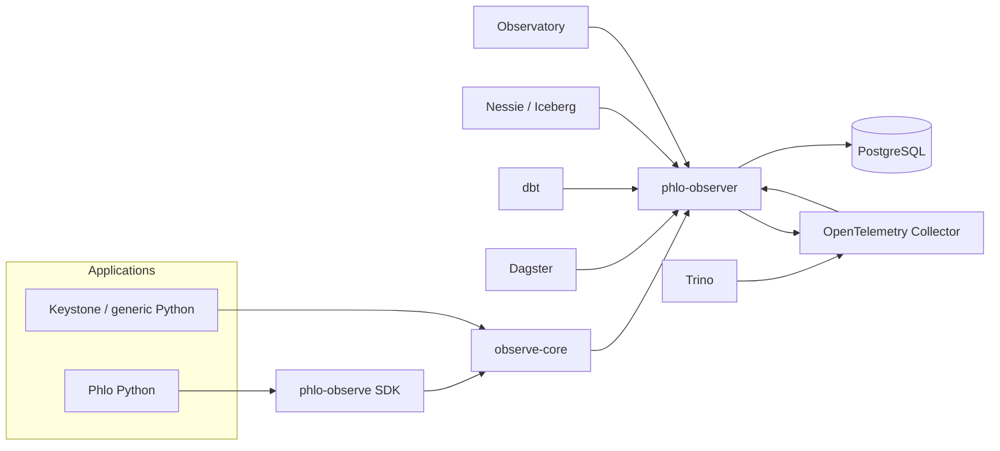

# phlo-observe V1 Implementation Specification

Status: **Proposed V1**  
Audience: maintainers and implementation engineers  
Primary implementation language: **Python 3.12+**  
Repository: `phlohouse/phlo-observe`

---

## 1. Purpose

`phlo-observe` provides a coherent observability system for Phlo and other Python applications such as Keystone.

The problem it solves is not a lack of logs. Phlo already consists of systems that emit their own telemetry: Dagster, dbt, Trino, Nessie, Iceberg, object storage, PostgreSQL, and application code. The problem is that those signals are fragmented, use different schemas, and are hard to correlate into one understandable story for a pipeline run, asset materialization, validation failure, WAP branch, or promotion.

V1 therefore has three distinct components:

1. **`observe-core`** — a generic Python library for operation-scoped wide events, structured errors, context propagation, asynchronous emission, redaction, sampling, and pluggable drains. This component is not Phlo-specific and may be used by Keystone or other applications.
2. **`phlo-observe-sdk`** — Phlo-specific enrichers, helpers, integrations, schemas, and adapters that add concepts such as runs, assets, partitions, WAP branches, Iceberg tables/snapshots, Dagster context, dbt invocations, and data-quality outcomes.
3. **`phlo-observer`** — a long-running service that consumes first-party Phlo events and telemetry from external systems, preserves the raw source data, normalizes signals into a canonical event model, correlates related events, persists them, exposes query APIs, and forwards telemetry to OpenTelemetry-compatible backends.

This is a **proper V1**, not a prototype. The implementation must be production-usable, documented, tested, configurable, observable, safe under failure, and designed so Observatory can rely on it as its event data plane.

---

## 2. V1 goals

V1 MUST provide all of the following:

- One coherent event model across first-party Phlo code and external systems.
- Operation-scoped **wide events**: an operation accumulates context and emits one rich completion event rather than many unrelated informational log lines.
- Structured failures with machine-readable `code`, `message`, `why`, `fix`, exception type, and traceback information.
- Correlation across service, run, asset, partition, branch, table, snapshot, trace, and invocation identifiers.
- A low-overhead application path. Emitting telemetry MUST NOT normally wait for network I/O.
- A bounded in-process queue with explicit backpressure/drop policy.
- Batch export.
- Pluggable drains, including console, JSONL, and OTLP-compatible export.
- Redaction of secrets and configured sensitive fields before events leave the application process.
- Context propagation using Python `contextvars`.
- Sync and async Python support.
- A Phlo SDK with explicit helpers for Dagster, dbt, DLT, WAP, Iceberg/Nessie, Pandera/data-quality, and generic pipeline operations.
- A `phlo-observer` HTTP service that can ingest canonical events and supported external telemetry.
- Raw source preservation for externally ingested telemetry.
- Normalization into a versioned canonical event envelope.
- Correlation and derivation of run timelines.
- Persistent storage that can support Observatory queries.
- Health, readiness, metrics, and diagnostic endpoints.
- Docker images and Docker Compose development setup.
- Typed configuration and environment-variable support.
- Schema versioning and compatibility rules.
- Comprehensive unit, integration, contract, concurrency, failure, and performance tests.
- Published Python packages and a published observer container image.
- Documentation sufficient for a junior developer to implement and maintain the system.

---

## 3. Non-goals for V1

V1 MUST NOT attempt to become:

- a replacement for OpenTelemetry;
- a replacement for Loki, Prometheus, Tempo, Datadog, or other telemetry backends;
- a full log-search product;
- a general-purpose distributed tracing backend;
- a metrics time-series database;
- the authoritative GxP audit trail for regulated records;
- a SIEM;
- a workflow orchestrator;
- a generic event bus;
- a Rust implementation.

The architecture MUST allow a future Rust hot path or edge agent if profiling demonstrates a concrete need. No V1 API should depend on implementation details that would prevent replacing internal Python queue/serialization code later.

---

## 4. Architectural principles

### 4.1 Events over log lines

The primary abstraction is an **event describing an operation**, not a stream of textual log messages.

Example:

```python
from observe_core import observe

with observe("asset.materialize") as event:
    event.set(
        asset="silver.experiments",
        partition="2026-09-14",
    )
    frame = transform(source)
    event.set(rows_out=len(frame))
```

The operation emits one completed event containing:

- operation name;
- outcome;
- duration;
- accumulated context;
- active correlation IDs;
- structured error details if failed.

Debug logs remain valid and useful, but MUST be treated as a separate lower-level signal.

### 4.2 Preserve source truth

When ingesting telemetry from Dagster, dbt, Trino, Nessie, or any other external producer, the observer MUST preserve the original source payload or a lossless serialized representation before/alongside normalization.

Normalization MUST NOT destroy information.

### 4.3 Canonical semantics

The system MUST normalize common concepts into a stable Phlo event envelope while retaining source-specific fields.

### 4.4 Correlation, not forced flattening

Not every producer has the same model. The observer should correlate related signals through identifiers and relationships rather than forcing every source into an over-simplified shape.

### 4.5 Open standards at boundaries

Use OpenTelemetry/OTLP for interoperability wherever practical. Phlo MAY define richer domain events internally, but should not invent a proprietary transport when OTLP or plain HTTP/JSON is sufficient.

### 4.6 No network I/O on the normal application hot path

Application code should normally enqueue a completed event and continue. Export happens in a worker thread/task.

### 4.7 Explicit durability classes

V1 defines three delivery classes:

- `debug`: best-effort, freely droppable when under pressure;
- `telemetry`: normal operational event, buffered and retried within configured limits;
- `critical`: failures, data-quality decisions, WAP promotion/rejection, or other high-value operational records; must use local spooling if the configured remote drain is unavailable.

These are observability durability classes, not regulatory classifications.

### 4.8 Safe defaults

The default configuration MUST:

- redact known secret fields;
- avoid capturing full dataframe rows or arbitrary user data;
- bound queue and payload sizes;
- avoid blocking forever during shutdown;
- avoid crashing application workloads when telemetry fails.

---

# Part I — repository and package structure

## 5. Repository layout

V1 MUST use a monorepo structure similar to:

```text
phlo-observe/
├── README.md
├── LICENSE
├── pyproject.toml
├── uv.lock
├── ruff.toml                 # if not entirely in pyproject
├── mkdocs.yml
├── docker-compose.yml
├── .github/
│   └── workflows/
│       ├── ci.yml
│       ├── release-python.yml
│       └── release-observer.yml
├── docs/
│   ├── V1_SPEC.md
│   ├── architecture.md
│   ├── event-model.md
│   ├── configuration.md
│   ├── integrations.md
│   ├── deployment.md
│   ├── troubleshooting.md
│   └── examples/
├── packages/
│   ├── observe-core/
│   │   ├── pyproject.toml
│   │   ├── src/observe_core/
│   │   └── tests/
│   └── phlo-observe-sdk/
│       ├── pyproject.toml
│       ├── src/phlo_observe/
│       └── tests/
├── services/
│   └── phlo-observer/
│       ├── pyproject.toml
│       ├── Dockerfile
│       ├── src/phlo_observer/
│       ├── migrations/
│       └── tests/
├── schemas/
│   ├── event-envelope-v1.schema.json
│   ├── error-v1.schema.json
│   └── source-payload-v1.schema.json
├── examples/
│   ├── basic-python/
│   ├── dagster/
│   ├── dbt/
│   ├── dlt/
│   └── keystone-style-app/
└── tests/
    ├── contract/
    ├── integration/
    └── performance/
```

The exact naming MAY vary slightly, but the three logical components MUST remain separate packages/services.

## 6. Package names

Python distribution names:

- `observe-core`
- `phlo-observe`
- `phlo-observer`

Import names:

```python
import observe_core
import phlo_observe
import phlo_observer
```

If package publication constraints require alternate distribution names, import names MUST remain stable.

---

# Part II — canonical event model

## 7. Event envelope

Every normalized V1 event MUST conform to `event-envelope-v1.schema.json`.

Required top-level shape:

```json
{
  "schema_version": "1.0",
  "event_id": "01J...",
  "event": "asset.materialize",
  "category": "data",
  "outcome": "success",
  "severity": "info",
  "delivery": "telemetry",
  "started_at": "2026-09-14T21:15:10.120Z",
  "ended_at": "2026-09-14T21:15:11.962Z",
  "duration_ms": 1842,
  "observed_at": "2026-09-14T21:15:11.970Z",
  "service": {},
  "correlation": {},
  "attributes": {},
  "error": null,
  "source": {}
}
```

### 7.1 Required fields

`schema_version`
: String. Must be `1.x` for V1.

`event_id`
: Globally unique sortable identifier. Use UUIDv7 if the standard library/dependency choice is stable and tested; otherwise use ULID. The project MUST choose one and use it consistently. Recommended: UUIDv7.

`event`
: Dot-delimited stable operation/event name. Examples: `pipeline.run`, `asset.materialize`, `quality.validate`, `wap.promote`, `dbt.model.execute`.

`category`
: One of `application`, `pipeline`, `data`, `quality`, `wap`, `query`, `storage`, `infrastructure`, `security`, `observer`, `other`.

`outcome`
: One of `success`, `failure`, `cancelled`, `partial`, `unknown`.

`severity`
: One of `trace`, `debug`, `info`, `warn`, `error`, `critical`.

`delivery`
: One of `debug`, `telemetry`, `critical`.

`observed_at`
: UTC RFC3339 timestamp for when this record was emitted or observed.

### 7.2 Optional timing fields

`started_at`, `ended_at`, and `duration_ms` may be null for instantaneous events.

If all three are present, tests MUST enforce that `duration_ms` is consistent with timestamps within a small rounding tolerance.

### 7.3 Service object

```json
{
  "name": "phlo-dagster",
  "version": "1.4.2",
  "instance_id": "container-or-process-id",
  "environment": "production",
  "host": "worker-03"
}
```

Only `name` is required when `service` is present.

### 7.4 Correlation object

Canonical keys:

```json
{
  "trace_id": null,
  "span_id": null,
  "parent_span_id": null,
  "run_id": null,
  "job_id": null,
  "invocation_id": null,
  "asset_key": null,
  "partition_key": null,
  "branch": null,
  "table": null,
  "snapshot_id": null,
  "pipeline": null,
  "experiment_id": null,
  "request_id": null
}
```

Unknown correlation keys MUST go in `correlation.extra`, not be added ad hoc at the top level.

### 7.5 Attributes

`attributes` is a JSON object containing event-specific structured data.

Rules:

- max nesting depth: configurable, default 8;
- max serialized event size before rejection/truncation: default 256 KiB;
- values must be JSON serializable after normalization;
- `bytes`, `Path`, `datetime`, `UUID`, enums, dataclasses and Pydantic models SHOULD have explicit encoders;
- arbitrary object `repr()` MUST NOT be silently used in production because it may expose secrets;
- pandas/polars dataframes MUST NOT be serialized automatically;
- event producers should record counts, identifiers and summaries instead of row-level data.

### 7.6 Error object

For failed events:

```json
{
  "code": "SCHEMA_NULL_VIOLATION",
  "message": "Schema validation failed",
  "why": "Column sample_id contained 14 null values",
  "fix": "Correct source metadata or explicitly allow null values",
  "exception_type": "SchemaError",
  "retryable": false,
  "stacktrace": "...",
  "details": {
    "column": "sample_id",
    "null_count": 14
  }
}
```

`message` is required. Other fields may be null.

The public error API MUST discourage dumping arbitrary exception locals into telemetry.

### 7.7 Source object

Canonical source representation:

```json
{
  "producer": "dagster",
  "producer_version": "1.x",
  "kind": "ASSET_MATERIALIZATION",
  "raw_ref": "raw://...",
  "adapter": "dagster.v1",
  "ingested_at": "..."
}
```

For first-party SDK events, `producer` SHOULD identify the application rather than claim an external adapter.

---

## 8. Event naming rules

Names MUST:

- be lowercase ASCII;
- use dot-separated namespaces;
- describe a stable domain operation rather than a sentence;
- avoid embedding IDs in names;
- avoid status suffixes such as `.success` and `.failed`; outcome belongs in `outcome`.

Preferred V1 vocabulary:

```text
application.start
application.stop
pipeline.run
pipeline.step
asset.materialize
ingestion.extract
ingestion.load
transform.execute
quality.validate
quality.check
wap.branch.create
wap.validate
wap.promote
wap.reject
wap.cleanup
dbt.invocation
dbt.model.execute
dbt.test.execute
dlt.pipeline.run
iceberg.commit
iceberg.snapshot.create
nessie.commit
nessie.branch.create
trino.query
observer.ingest
observer.normalize
observer.correlate
observer.export
```

The SDK MUST publish a registry/constants module to avoid uncontrolled string proliferation.

---

# Part III — Component 1: observe-core

## 9. Scope

`observe-core` is generic. It MUST NOT import Dagster, dbt, DLT, Iceberg, Nessie, Pandera, Phlo, or Keystone packages.

Its responsibility is the mechanics of reliable structured event creation and emission.

## 10. Public API

Minimum supported public API:

```python
from observe_core import (
    observe,
    event,
    bind_context,
    clear_context,
    get_context,
    ObservedError,
    configure,
    shutdown,
    flush,
)
```

### 10.1 `observe()` context manager

```python
with observe(
    "asset.materialize",
    category="data",
    delivery="telemetry",
    attributes={"asset": "silver.samples"},
) as evt:
    evt.set(rows_in=100)
    ...
    evt.set(rows_out=98)
```

Requirements:

- records monotonic start time;
- emits exactly one completion event when the outermost operation exits;
- marks `success` if the block exits normally unless explicitly overridden;
- marks `failure` on unhandled exception;
- converts structured errors to the canonical error shape;
- optionally captures stacktrace for unexpected exceptions;
- re-raises application exceptions by default;
- never swallows an application exception unless explicitly requested by an advanced API;
- works in synchronous and asynchronous contexts.

Async:

```python
async with observe("query.execute") as evt:
    ...
```

### 10.2 Decorator support

```python
@observe("transform.execute")
def transform(...):
    ...

@observe("ingestion.extract")
async def extract(...):
    ...
```

Decorator MUST preserve function metadata via `functools.wraps`.

### 10.3 Event builder

The yielded event object MUST support:

```python
evt.set(foo="bar", rows=10)
evt.set_attribute("foo", "bar")
evt.set_correlation(run_id="...")
evt.set_outcome("partial")
evt.set_severity("warn")
evt.set_delivery("critical")
evt.add_warning(code="...", message="...")
evt.annotate("human readable note")
```

`annotate()` MUST store notes in structured attributes; it is not a separate emitted log line.

The builder MUST be implemented as a lightweight Python object/dictionary. V1 MUST NOT cross an FFI boundary for each field assignment.

### 10.4 Instantaneous events

```python
event(
    "wap.promote",
    category="wap",
    delivery="critical",
    attributes={...},
)
```

This emits an event without a measured operation duration.

### 10.5 Context binding

```python
with bind_context(run_id=run_id, service_name="phlo-dagster"):
    ...
```

Also support explicit token-based binding for frameworks that cannot use a context manager cleanly.

Context storage MUST use `contextvars.ContextVar` so values propagate correctly across asyncio tasks.

Thread-pool propagation MUST be documented; helper utilities MAY be supplied where context copy is needed.

Precedence rules:

1. explicit event values;
2. active operation context;
3. bound ambient context;
4. configured service defaults.

### 10.6 Structured errors

```python
raise ObservedError(
    code="MISSING_METADATA",
    message="Sample metadata is incomplete",
    why="Three wells have no sample identifier",
    fix="Update the source metadata and rerun",
    retryable=False,
    details={"wells": ["A01", "B04", "C07"]},
)
```

Requirements:

- derives from `Exception`;
- all fields accessible programmatically;
- serializes predictably;
- supports exception chaining;
- does not require a `fix` when no remediation is known;
- supports a cause without recursively serializing arbitrary object graphs.

## 11. Internal pipeline

Completed event flow:

```text
builder
  -> merge context
  -> normalize values
  -> redact
  -> validate limits
  -> enqueue
  -> worker batch
  -> drain fan-out
```

Redaction MUST happen before the event is passed to any drain.

## 12. Queue and worker

V1 MUST implement an in-process bounded queue and one or more background workers.

Default behaviour:

- queue capacity: 10,000 events;
- batch size: 100;
- flush interval: 1 second;
- enqueue should normally be non-blocking;
- worker thread is daemonized but explicit shutdown is still required;
- `atexit` handler performs best-effort bounded flush;
- async applications MUST NOT require a separate implementation path just to enqueue.

### 12.1 Queue pressure

When full:

- `debug`: drop newest by default;
- `telemetry`: drop according to configured policy and increment an internal counter;
- `critical`: write to local spool synchronously if possible; if spooling fails, emit a minimal stderr diagnostic and increment a failure counter.

Critical event handling MUST NOT block indefinitely.

The library MUST expose counters for dropped and spooled events.

## 13. Drains

Define protocol:

```python
class Drain(Protocol):
    def emit_batch(self, events: Sequence[EventEnvelope]) -> None: ...
    def flush(self) -> None: ...
    def close(self) -> None: ...
```

V1 drains:

### 13.1 Console drain

Human-readable local development output.

Features:

- concise one-line completion summary;
- optional expanded error details;
- color only if TTY and enabled;
- no required Rich dependency in core unless justified;
- secrets already redacted upstream.

### 13.2 JSONL drain

Append one canonical JSON object per line.

Requirements:

- atomic line writes as practical;
- configurable file path;
- rotation by size required for V1;
- retain configurable number of files;
- UTF-8;
- fsync strategy configurable for critical use cases.

### 13.3 HTTP/observer drain

Batch POST canonical events to `phlo-observer`.

Requirements:

- HTTP keepalive;
- connect/read/write timeouts;
- exponential backoff with jitter;
- bounded retries;
- optional bearer token/API key;
- gzip request body above configurable threshold;
- 413 handling by splitting batches;
- retry only retryable status classes;
- critical failures spool locally.

### 13.4 OTLP drain

Support export to an OpenTelemetry Collector using an official, maintained OpenTelemetry Python exporter where reasonable.

The event envelope MAY be represented as OTel logs/events, preserving correlation identifiers and attributes.

V1 MUST document the mapping.

## 14. Spool

Local spool is required for `critical` delivery events when a remote drain cannot accept them.

Recommended implementation: directory of append-only JSONL segment files rather than SQLite unless testing proves SQLite simpler and robust under concurrent process conditions.

Requirements:

- configurable spool directory;
- maximum spool size;
- segment rotation;
- replay oldest first;
- only delete segment after confirmed remote acceptance;
- corrupt segment quarantine;
- spool diagnostics and metrics;
- no infinite disk growth;
- clear policy when capacity is exhausted.

Default maximum: 1 GiB.

## 15. Serialization

Use `orjson` if benchmarks demonstrate a meaningful improvement and packaging remains simple; otherwise standard JSON is acceptable. The implementation decision MUST be benchmarked and documented.

Canonical JSON output MUST:

- use UTC timestamps;
- preserve Unicode;
- reject NaN/Infinity or normalize them explicitly;
- have deterministic field names;
- not rely on Python `repr`.

## 16. Redaction

Default case-insensitive secret key patterns:

```text
password
passwd
secret
token
api_key
apikey
authorization
cookie
set-cookie
client_secret
access_key
private_key
```

Support:

- exact key list;
- regex key patterns;
- dotted path rules;
- optional value regexes for common bearer/key patterns;
- replacement marker `[REDACTED]`.

Redaction MUST traverse nested dictionaries/lists within configured depth.

Tests MUST verify secrets do not reach console, files, HTTP test servers, or spool files.

## 17. Sampling

Sampling occurs after determining delivery class.

Defaults:

- `critical`: never sampled;
- `telemetry`: 100%;
- `debug`: configurable, default 100% in development and 10% in production profile.

Support deterministic sampling by event name + correlation ID to reduce confusing partial histories.

## 18. Standard `logging` integration

V1 MUST provide optional integration with Python stdlib `logging`.

Two supported directions:

1. Attach active correlation identifiers to stdlib log records.
2. Optional handler converts selected stdlib log records into `application.log` events.

This MUST be opt-in to avoid loops and duplicate telemetry.

## 19. Core configuration

Use a typed settings object, e.g. Pydantic Settings or equivalent.

Example environment variables:

```text
OBSERVE_ENABLED=true
OBSERVE_SERVICE_NAME=phlo-dagster
OBSERVE_ENVIRONMENT=development
OBSERVE_QUEUE_CAPACITY=10000
OBSERVE_BATCH_SIZE=100
OBSERVE_FLUSH_INTERVAL_MS=1000
OBSERVE_DRAINS=console,http
OBSERVE_HTTP_ENDPOINT=http://phlo-observer:8080/v1/events
OBSERVE_HTTP_TOKEN=...
OBSERVE_SPOOL_DIR=/var/lib/phlo-observe/spool
OBSERVE_SPOOL_MAX_BYTES=1073741824
OBSERVE_CAPTURE_STACKTRACE=true
OBSERVE_MAX_EVENT_BYTES=262144
OBSERVE_REDACT_KEYS=password,token,secret
```

Settings MUST also be constructible programmatically for tests/notebooks.

## 20. Lifecycle API

```python
configure(settings)
flush(timeout=5.0)
shutdown(timeout=5.0)
```

Requirements:

- repeated `shutdown()` is safe;
- repeated `configure()` either safely reconfigures or raises a clear documented error;
- tests MUST cover interpreter shutdown and worker failure;
- application exit MUST not hang indefinitely because telemetry backend is down.

---

# Part IV — Component 2: Phlo SDK

## 21. Scope

`phlo-observe-sdk` depends on `observe-core` and adds Phlo semantics. Optional integration extras MUST prevent installing the SDK from pulling every ecosystem dependency.

Example extras:

```text
phlo-observe[dagster]
phlo-observe[dbt]
phlo-observe[dlt]
phlo-observe[pandera]
phlo-observe[all]
```

## 22. Domain context

Provide typed context helpers for:

### Run

```python
with phlo_run_context(
    run_id="...",
    job="daily_ingestion",
    attempt=1,
):
    ...
```

### Asset

```python
with asset_context(
    asset_key="silver.samples",
    partition_key="2026-09-14",
):
    ...
```

### WAP

```python
with wap_context(
    branch="run/01J...",
    base_branch="main",
):
    ...
```

### Table/snapshot

```python
with table_context(
    table="silver.samples",
    catalog="nessie",
    namespace="silver",
    snapshot_id="81293",
):
    ...
```

These MUST compose through `contextvars`.

## 23. Phlo event attributes

Define typed models/helpers for common event payloads.

Examples:

### `pipeline.run`

```json
{
  "job": "daily_ingestion",
  "attempt": 1,
  "trigger": "schedule",
  "assets": 14
}
```

### `asset.materialize`

```json
{
  "asset_key": "silver.samples",
  "partition_key": "2026-09-14",
  "rows_in": 14291,
  "rows_out": 14277,
  "bytes_written": 5832031
}
```

### `quality.validate`

```json
{
  "suite": "silver_samples",
  "checks_total": 12,
  "checks_passed": 11,
  "checks_failed": 1,
  "rows_checked": 14277,
  "rows_failed": 8
}
```

### `wap.promote`

```json
{
  "branch": "run/01J...",
  "target": "main",
  "commit_id": "...",
  "checks_passed": 12
}
```

## 24. Dagster integration

V1 MUST support Dagster without requiring users to manually bind standard identifiers everywhere.

Provide:

- helper/resource that binds Dagster run ID, job name, op/asset, partition and retry attempt;
- event helpers for asset materializations/checks;
- hooks or utilities for job/run lifecycle where supported cleanly by Dagster;
- documentation showing integration in a Definitions-based project.

Do NOT monkeypatch Dagster internals.

If Dagster emits telemetry to the observer separately, SDK context and external Dagster events MUST correlate using Dagster run ID.

## 25. dbt integration

Support both dbt executed through Dagster and independently.

V1 MUST include a parser/adapter for dbt artifacts:

- `manifest.json` for metadata where needed;
- `run_results.json` for invocation/model/test results.

Normalize at least:

- invocation start/completion;
- model execution;
- test execution;
- status;
- timing;
- relation/model identifier;
- adapter response rows affected where available;
- invocation ID.

The SDK MAY expose a convenience helper for application code, while full artifact ingestion may occur in the observer.

## 26. DLT integration

Provide wrappers/helpers around DLT pipeline execution where practical.

Capture:

- pipeline name;
- source/resource;
- load ID/package ID if available;
- destination;
- table;
- rows loaded when available;
- started/completed timing;
- failure details.

Avoid depending on undocumented DLT internals when a stable public API or load info object exists.

## 27. Data-quality integration

Pandera is the initial first-party quality integration.

Provide helpers to translate validation results/exceptions into canonical quality attributes.

Capture summaries, not full data.

Required fields where available:

- schema/suite name;
- checks total/passed/failed;
- rows checked;
- rows failed;
- failing columns;
- failure codes/reasons;
- lazy validation state.

Limit example failing values to a configurable small number and redact them by default in production unless explicitly enabled.

The abstraction SHOULD be general enough to later support Great Expectations/Soda without altering canonical quality event names.

## 28. WAP integration

WAP is a first-class Phlo domain.

Required events:

```text
wap.branch.create
wap.validate
wap.promote
wap.reject
wap.cleanup
```

Common correlation:

- run ID;
- branch;
- base branch;
- target branch;
- table;
- snapshot/commit IDs.

`wap.promote` and `wap.reject` default to `critical` delivery because they represent consequential platform decisions.

## 29. Iceberg/Nessie integration

The SDK should provide helper functions for code directly managing Iceberg/Nessie operations.

Capture where available:

- catalog;
- namespace;
- table;
- branch/reference;
- snapshot ID before/after;
- commit hash;
- schema ID;
- operation (`append`, `overwrite`, `delete`, `rewrite`, etc.);
- files added/removed;
- rows added/removed when available.

Do not require expensive table scans solely for observability fields.

## 30. Trino integration

The SDK need not instrument Trino server internals. For client-side Phlo query execution, provide helper context/events capturing:

- query ID;
- catalog/schema;
- query class (`select`, `insert`, `create`, etc.);
- duration;
- rows/bytes processed if available;
- state;
- failure code/type;
- linked run/asset/table.

SQL text MUST be configurable and disabled by default in production because it may contain sensitive values. Prefer query hash plus optional sanitized statement.

## 31. Phlo logging bridge

Provide a standard logging configuration helper that:

- outputs normal application logs;
- binds event/run/trace IDs;
- prevents duplicate handlers;
- does not force a specific logging framework on all Phlo services.

---

# Part V — Component 3: phlo-observer

## 32. Responsibilities

`phlo-observer` is the central ingestion/correlation/query service.

It MUST:

- receive canonical events from `observe-core`/Phlo SDK;
- ingest supported external telemetry;
- validate payloads;
- preserve source/raw information;
- normalize telemetry;
- correlate events;
- persist events;
- derive run/timeline views;
- expose APIs for Observatory and diagnostics;
- optionally forward normalized telemetry to OTLP/backends;
- expose its own metrics and internal observability.

It MUST NOT be required for local library use. `observe-core` can still emit console/JSONL/OTLP directly.

## 33. Technology choices

V1 recommended stack:

- Python 3.12+
- FastAPI
- Pydantic v2
- SQLAlchemy 2.x async or SQLModel only if it does not limit control
- PostgreSQL
- Alembic
- `httpx`
- `uvicorn`
- Prometheus client

PostgreSQL is the V1 canonical store for normalized observer data. This avoids making the observer dependent on Phlo's lakehouse being healthy in order to explain why the lakehouse is unhealthy.

The observer MUST NOT store its operational database in Iceberg for V1.

## 34. Ingestion APIs

### 34.1 Canonical event ingestion

`POST /v1/events`

Accept either:

- a single canonical event;
- a JSON array/batch;
- gzip content encoding.

Response:

```json
{
  "accepted": 98,
  "rejected": 2,
  "errors": [
    {
      "index": 14,
      "code": "SCHEMA_INVALID",
      "message": "event is required"
    }
  ]
}
```

Use `202 Accepted` when successfully queued/persisted according to configured ingestion architecture.

Support idempotency by `event_id`. Duplicate canonical events MUST not create duplicate normalized rows.

### 34.2 External source ingestion

Provide source-specific endpoints/adapters under:

```text
POST /v1/ingest/dagster
POST /v1/ingest/dbt
POST /v1/ingest/otlp   # only if implementing direct OTLP receiver is reasonable
POST /v1/ingest/generic
```

However, where existing systems already expose OTLP, Prometheus, logs, or webhooks, the preferred production architecture may route through an OpenTelemetry Collector. The observer adapters MUST be documented as direct-ingestion options, not mandatory replacements for Collector receivers.

### 34.3 File/artifact ingestion

`POST /v1/ingest/dbt/artifacts`

Accept dbt `run_results.json` plus optional `manifest.json` with size limits.

The service MUST parse and normalize these without retaining an unnecessary duplicate of very large artifacts unless configured.

## 35. Adapter architecture

Define adapter protocol:

```python
class SourceAdapter(Protocol):
    name: str
    version: str

    def can_handle(self, payload: RawPayload) -> bool: ...
    def normalize(self, payload: RawPayload) -> list[EventEnvelope]: ...
```

Adapters MUST be isolated modules with contract tests and fixture payloads.

Suggested modules:

```text
adapters/
├── canonical.py
├── dagster.py
├── dbt.py
├── trino.py
├── nessie.py
├── otel.py
└── generic.py
```

A malformed source event MUST not crash the observer process.

## 36. Raw payload storage

The database MUST retain enough source information to debug normalization.

Table concept:

```text
raw_events
- id UUID/UUIDv7
- received_at timestamptz
- producer text
- source_kind text
- source_version text null
- content_type text
- payload jsonb or compressed bytes
- payload_sha256 text
- adapter text null
- normalization_status text
- normalization_error jsonb null
- expires_at timestamptz null
```

Raw retention MUST be configurable independently from normalized event retention.

Default suggested raw retention: 14 days.

Sensitive source payload retention can be disabled per adapter.

## 37. Normalized event storage

Table concept:

```text
events
- event_id uuid primary key
- schema_version text
- event text
- category text
- outcome text
- severity text
- delivery text
- started_at timestamptz null
- ended_at timestamptz null
- duration_ms double precision null
- observed_at timestamptz not null
- received_at timestamptz not null
- service_name text null
- service_version text null
- environment text null
- trace_id text null
- span_id text null
- run_id text null
- job_id text null
- invocation_id text null
- asset_key text null
- partition_key text null
- branch text null
- table_name text null
- snapshot_id text null
- pipeline text null
- attributes jsonb not null
- error jsonb null
- source jsonb not null
- raw_event_id uuid null references raw_events
```

Indexes MUST include:

- `observed_at`;
- `run_id, observed_at`;
- `asset_key, observed_at`;
- `event, observed_at`;
- `outcome, observed_at`;
- `trace_id`;
- `branch`;
- `table_name, observed_at`.

Use appropriate partial indexes if justified by query plans.

## 38. Derived correlation model

V1 MUST derive a `runs` projection rather than requiring Observatory to infer run state from raw event queries each time.

Suggested `runs` table/materialized projection:

```text
runs
- run_id text primary key
- job_name text null
- service_name text null
- environment text null
- status text
- started_at timestamptz
- ended_at timestamptz null
- duration_ms double precision null
- trigger text null
- event_count integer
- error_count integer
- warning_count integer
- asset_count integer
- branch text null
- updated_at timestamptz
- summary jsonb
```

Status precedence:

1. explicit terminal `pipeline.run` event;
2. explicit external orchestrator terminal state;
3. derived status from correlated events;
4. `unknown`.

V1 run statuses:

```text
running
success
failure
partial
cancelled
unknown
```

## 39. Correlation rules

Correlation MUST be deterministic and documented.

Primary identifiers in descending confidence:

1. explicit `run_id`;
2. explicit `trace_id`;
3. known producer-native run/invocation ID mapping;
4. branch identifier created for a run;
5. configured integration mapping.

Time proximity alone MUST NOT silently merge events into the same run.

If correlation is ambiguous, preserve events uncorrelated rather than guessing.

Maintain correlation metadata such as:

```json
{
  "method": "explicit_run_id",
  "confidence": 1.0
}
```

for derived mappings where useful.

## 40. Timeline derivation

Observer MUST expose a coherent timeline view for a run.

Example:

```json
{
  "run_id": "01J...",
  "status": "success",
  "started_at": "...",
  "duration_ms": 18400,
  "steps": [
    {
      "event_id": "...",
      "event": "ingestion.load",
      "label": "Ingest",
      "outcome": "success",
      "duration_ms": 1200,
      "summary": "14,291 rows"
    },
    {
      "event": "quality.validate",
      "label": "Validate",
      "outcome": "success",
      "summary": "12/12 checks passed"
    },
    {
      "event": "wap.promote",
      "label": "Promote",
      "outcome": "success",
      "summary": "run/01J... -> main"
    }
  ]
}
```

Observer, not Observatory UI, owns the semantic derivation of default labels/summaries.

## 41. Query API

Required endpoints:

```text
GET /v1/events
GET /v1/events/{event_id}
GET /v1/runs
GET /v1/runs/{run_id}
GET /v1/runs/{run_id}/timeline
GET /v1/assets/{asset_key}/events
GET /v1/branches/{branch}/events
GET /v1/tables/{table}/events
```

### 41.1 Filtering

`GET /v1/events` MUST support:

- time range;
- event name;
- category;
- outcome;
- severity;
- service;
- environment;
- run ID;
- asset;
- partition;
- branch;
- table;
- trace ID.

### 41.2 Pagination

Use cursor pagination, not deep OFFSET pagination.

Default page size: 100. Maximum: 1000.

Cursor should be based on stable ordering such as `(observed_at, event_id)`.

## 42. Search

V1 does NOT need a full-text search engine.

Basic PostgreSQL filtering is sufficient. Optional text search can target event name, error message/code and selected attributes, but must not become a major V1 subsystem.

## 43. Authentication and authorization

V1 MUST support deployment behind a trusted internal reverse proxy and also direct service authentication.

Minimum:

- ingestion API token(s) configured through secrets/env;
- separate read token or authenticated proxy for query APIs;
- `/health/live` can be unauthenticated;
- `/health/ready` may be unauthenticated inside trusted networks;
- metrics endpoint policy configurable.

Tokens MUST be compared safely and MUST never be logged.

Design should allow future OIDC/Keycloak integration without changing API semantics.

## 44. Health endpoints

```text
GET /health/live
GET /health/ready
```

Liveness checks only process responsiveness.

Readiness MUST check:

- database connectivity;
- migration compatibility;
- ingestion worker state;
- optional mandatory exporter state only if configured to gate readiness.

## 45. Observer metrics

Expose Prometheus metrics at `/metrics`.

At minimum:

```text
phlo_observer_ingest_events_total{producer,status}
phlo_observer_ingest_batches_total{status}
phlo_observer_normalization_total{adapter,status}
phlo_observer_normalization_duration_seconds
phlo_observer_persist_duration_seconds
phlo_observer_events_stored_total
phlo_observer_duplicate_events_total
phlo_observer_correlation_total{method}
phlo_observer_http_requests_total{route,status}
phlo_observer_http_request_duration_seconds{route}
phlo_observer_export_total{destination,status}
phlo_observer_queue_depth
```

Avoid high-cardinality labels such as run ID or asset key.

## 46. Observer self-observation

The observer MUST use `observe-core` internally, but guard against recursive export loops.

Internal events can be sent to console/OTLP while ingestion requests are processing. They MUST NOT automatically POST back into the same observer endpoint.

## 47. External forwarding

Observer SHOULD support forwarding normalized events to OTLP.

This is optional per deployment.

Forward failures MUST not prevent local persistence unless explicitly configured.

## 48. Retention

Configurable independently:

- raw payloads: default 14 days;
- normalized events: default 90 days;
- derived run summaries: default 365 days.

V1 MUST include a scheduled cleanup job/process within observer. It may run in the service process with leader-safe assumptions for a single replica, or as a documented external scheduled command. If supporting multiple replicas, cleanup locking MUST prevent duplicate destructive work.

## 49. Database migrations

Alembic migrations are mandatory.

CI MUST test:

- migration from empty database to head;
- downgrade at least one migration where practical;
- application refuses or reports clearly when DB schema is incompatible.

---

# Part VI — External telemetry integration

## 50. Integration strategy

Phlo-observer must consume telemetry from existing platform systems without requiring every system to use the Python SDK.

There are three supported patterns:

1. **SDK-native** — Phlo Python application emits canonical events.
2. **Collector/telemetry-native** — system emits OTLP/logs/metrics to an OpenTelemetry Collector; selected records are routed to observer or a compatible adapter.
3. **Artifact/API polling/webhook adapter** — observer consumes system-specific artifacts or APIs where that is the best available interface.

Do not force all sources through one transport if doing so loses information.

## 51. Dagster source adapter

Normalize at minimum:

- run start;
- run success;
- run failure;
- run cancellation;
- asset materialization;
- asset check result;
- step start/completion/failure where useful.

Preserve Dagster event type and run ID.

Do not mirror every verbose engine event into normalized storage by default. Adapter MUST define an allowlist of meaningful event types.

## 52. dbt source adapter

Normalize from artifacts at minimum:

- invocation;
- model result;
- test result;
- seed/snapshot result if present and meaningful.

Fields:

- `unique_id`;
- node name;
- resource type;
- status;
- execution time;
- relation;
- adapter response summary;
- failures count for tests;
- invocation ID.

## 53. Trino source adapter

Preferred sources may include event listener output, OTLP/log integration, or Phlo client instrumentation depending on deployment.

Normalize meaningful query lifecycle events.

Never persist raw SQL by default.

Store query ID and sanitized metadata.

## 54. Nessie source adapter

Where practical, consume commit/reference operations from direct Phlo SDK events first. If server-side telemetry is available, correlate commits/branches using branch/ref and commit hashes.

Do not require Nessie polling that creates material operational load solely for V1 observability.

## 55. Iceberg

Iceberg operations may be observed through:

- Phlo SDK around table commits;
- engine/query metadata;
- catalog/Nessie commits.

Observer should correlate rather than assume a standalone Iceberg server emits all required telemetry.

## 56. Infrastructure telemetry

MinIO, PostgreSQL, container and host metrics remain primarily Prometheus/OTel concerns.

V1 observer SHOULD NOT ingest every infrastructure metric into its event database.

Instead Observatory may query the metrics backend separately, or future observer APIs may proxy/aggregate them.

Only infrastructure events that are useful in timelines (e.g. service unavailable, storage operation failure) should be normalized as events.

---

# Part VII — configuration and deployment

## 57. Observer settings

Suggested variables:

```text
PHLO_OBSERVER_HOST=0.0.0.0
PHLO_OBSERVER_PORT=8080
PHLO_OBSERVER_DATABASE_URL=postgresql+asyncpg://...
PHLO_OBSERVER_INGEST_TOKENS=...
PHLO_OBSERVER_READ_TOKENS=...
PHLO_OBSERVER_RAW_RETENTION_DAYS=14
PHLO_OBSERVER_EVENT_RETENTION_DAYS=90
PHLO_OBSERVER_RUN_RETENTION_DAYS=365
PHLO_OBSERVER_MAX_BODY_BYTES=10485760
PHLO_OBSERVER_MAX_BATCH_EVENTS=1000
PHLO_OBSERVER_OTLP_ENDPOINT=
PHLO_OBSERVER_LOG_LEVEL=INFO
PHLO_OBSERVER_METRICS_ENABLED=true
```

Secrets MUST support `_FILE` variants or Docker/Kubernetes secret mounting where feasible.

## 58. Docker image

Observer Dockerfile requirements:

- multi-stage build if beneficial;
- non-root runtime user;
- pinned base image major/minor;
- healthcheck documented;
- no compiler/build toolchain in final image unless required;
- image labels for source/revision/version;
- graceful SIGTERM handling;
- read-only root filesystem compatibility where possible with explicit writable paths.

## 59. Docker Compose development environment

Repository MUST provide compose services for at least:

```text
postgres
phlo-observer
otel-collector   # optional profile is acceptable
```

Provide a development `.env.example` with no secrets.

One command should start a working local environment.

## 60. OpenTelemetry Collector example

Include `examples/otel-collector-config.yaml` demonstrating:

- OTLP receiver;
- batching;
- optional attributes/redaction processor;
- route/export to chosen local backend and/or observer integration;
- comments explaining where Phlo-specific normalization occurs.

Do not make Collector configuration the only supported path for first-party canonical events.

---

# Part VIII — reliability semantics

## 61. Failure isolation

Observability MUST NOT cause a successful Phlo pipeline to fail solely because telemetry export is unavailable.

Exceptions:

- explicit configuration such as `telemetry_required=true` for a controlled use case;
- invalid critical event generation in tests/development if configured to fail fast.

Production default: fail open for telemetry, while emitting local diagnostics.

## 62. Retries

HTTP drain retry defaults:

- max attempts: 5;
- exponential backoff base: 250 ms;
- cap: 10 seconds;
- jitter enabled;
- retry network failures, 408, 429, 5xx;
- do not retry ordinary 4xx schema/auth errors;
- respect `Retry-After` where sane.

## 63. Idempotency

`event_id` is the idempotency key.

Observer inserts MUST use conflict-safe logic.

Duplicate event with identical payload: count and ignore.

Duplicate event ID with materially different payload: quarantine/report as integrity conflict; do not silently overwrite.

## 64. Ordering

Global ordering is not guaranteed.

Within one process, completion events should preserve enqueue order where practical.

Observer timeline uses source timestamps plus stable event ID tie-breaker.

Run views MUST tolerate late-arriving events.

## 65. Clock differences

Observer stores both `observed_at` and `received_at`.

Adapters SHOULD preserve producer timestamps.

Observer MAY flag large clock skew but MUST NOT rewrite source time silently.

## 66. Oversized events

Default event max: 256 KiB from SDK.

Observer body max: 10 MiB, batch max 1000 events by default.

If a field causes event overflow:

- safe known large optional fields may be truncated with explicit metadata;
- otherwise reject/diagnose event rather than silently dropping arbitrary content.

Add:

```json
{
  "_observe": {
    "truncated": true,
    "fields": ["attributes.query_plan"]
  }
}
```

if truncation occurs.

---

# Part IX — security and data governance

## 67. Data minimization

V1 design assumes telemetry may contain operational metadata but should avoid scientific/patient/personal raw data unless explicitly required.

SDK defaults MUST NOT serialize:

- dataframe records;
- file contents;
- environment dictionaries;
- HTTP request bodies;
- SQL values;
- secret-bearing connection strings;
- arbitrary exception locals.

## 68. Connection string sanitization

Utility MUST redact passwords/tokens from database, HTTP, S3 and similar URLs before storage.

## 69. Headers

If HTTP metadata is captured, allowlist safe headers rather than denylisting dangerous ones.

Authorization/Cookie headers are always redacted.

## 70. Audit versus observability

Documentation MUST explicitly state:

`phlo-observe` is an operational observability system. It may record decisions such as WAP promotion for visibility, but V1 is not by itself a validated authoritative electronic audit trail for GxP records.

If regulated workflows later depend on it as a system of record, separate requirements for immutability, identity, validation, retention, review, electronic signatures and change control are required.

---

# Part X — developer experience

## 71. Zero-to-first-event

README MUST make this possible in under five minutes:

```bash
pip install observe-core
```

```python
from observe_core import configure, observe

configure(...)

with observe("demo.work") as evt:
    evt.set(rows=100)
```

Then show console output.

## 72. Phlo quick start

```bash
pip install phlo-observe
```

```python
from phlo_observe import configure_phlo, observe

configure_phlo(service_name="example")

with observe("asset.materialize") as evt:
    ...
```

## 73. Error messages

Configuration errors MUST tell developers:

- what setting is invalid;
- received value where safe;
- allowed values/range;
- suggested correction.

Do not emit opaque Pydantic tracebacks as the primary CLI/service startup error.

## 74. CLI

Provide `phlo-observer` CLI:

```text
phlo-observer serve
phlo-observer migrate
phlo-observer check
phlo-observer config
phlo-observer replay-spool <path>   # if useful for operational recovery
```

`check` validates configuration and database connectivity without starting the HTTP server.

Provide optional `observe` diagnostic CLI if useful:

```text
observe emit-test
observe config
```

---

# Part XI — testing strategy

## 75. General standards

Target overall meaningful coverage >= 90%, but coverage percentage MUST NOT replace behavioural tests.

Use pytest.

Static checks:

- Ruff format/check;
- strict type checking with mypy or pyright; choose one project-wide;
- dependency vulnerability scanning in CI;
- build/package validation.

## 76. Core unit tests

Mandatory test groups:

- event builder fields;
- success lifecycle;
- exception lifecycle;
- structured errors;
- nested operations;
- context precedence;
- context isolation across asyncio tasks;
- thread behaviour;
- decorator sync/async;
- JSON normalization;
- redaction nested structures;
- sampling;
- queue full policies;
- worker failure;
- retry behaviour;
- flush/shutdown;
- spool write/replay/corruption;
- console output;
- JSONL rotation;
- HTTP batching;
- 413 split behaviour;
- duplicate configure/shutdown lifecycle.

## 77. Schema contract tests

Every emitted event fixture MUST validate against JSON Schema.

Compatibility tests MUST ensure V1 minor releases do not remove required fields or change field meaning incompatibly.

## 78. SDK tests

Use optional dependency test matrices.

At minimum:

- Dagster context mapping;
- dbt artifact fixture parsing;
- DLT helper mapping;
- Pandera result/exception mapping;
- WAP event helpers;
- Iceberg/Nessie context helpers;
- Trino query sanitization.

## 79. Observer API tests

Test:

- authentication;
- single ingestion;
- batch ingestion;
- partial batch rejection;
- gzip;
- max body;
- duplicate event IDs;
- integrity conflicts;
- filters;
- cursor pagination;
- timeline endpoint;
- late events updating run projection;
- health/readiness;
- metrics;
- retention cleanup.

## 80. Database integration tests

CI MUST start PostgreSQL and test real migrations/queries. SQLite MUST NOT be the only database used for tests.

## 81. Adapter fixture tests

Check in sanitized representative fixture payloads for supported source versions.

Each adapter MUST have golden expected canonical events.

## 82. Failure injection

Integration tests MUST simulate:

- observer unavailable;
- HTTP timeout;
- 429;
- 500;
- invalid token;
- database unavailable;
- database reconnect;
- malformed raw event;
- spool full;
- corrupt spool segment;
- worker thread exception;
- process shutdown with queued events.

## 83. Concurrency tests

Test at least:

- 100 concurrent asyncio tasks with isolated contexts;
- multiple producer threads;
- concurrent observer ingestion requests;
- duplicate submissions racing;
- database pool exhaustion behaviour.

## 84. Performance tests

Performance tests MUST measure overhead rather than assert that Python is inherently fast enough.

Benchmarks:

1. empty `with observe(...)` block with console/network disabled;
2. event with 10 scalar attributes;
3. event with nested attributes;
4. enqueue throughput;
5. serialization throughput;
6. batch HTTP drain throughput;
7. observer ingestion throughput;
8. timeline query with realistic event volume.

Initial V1 targets on a normal developer machine, to be refined after baseline measurements:

- median local operation bookkeeping overhead: < 100 microseconds excluding drain I/O;
- p95 enqueue completion for normal event: < 1 ms under non-saturated queue;
- sustain >= 10,000 small events/sec in synthetic enqueue benchmark without remote I/O;
- observer sustain >= 1,000 canonical events/sec to PostgreSQL in batch-oriented local test environment;
- run timeline query p95 < 500 ms for a run with <= 10,000 events on representative indexed dataset.

If these targets are missed, profile first. Rust is considered only after profiling identifies Python CPU/serialization as material rather than database/network configuration.

---

# Part XII — CI/CD and releases

## 85. CI workflow

On pull requests:

1. install locked dependencies;
2. format check;
3. lint;
4. type check;
5. unit tests;
6. PostgreSQL integration tests;
7. schema contract tests;
8. build Python packages;
9. build observer Docker image;
10. basic container smoke test.

Performance benchmarks may run on main/nightly unless stable enough for PR gating.

## 86. Versioning

Use semantic versioning independently for Python packages and observer image where necessary, but prefer synchronized V1 releases initially.

Schema version is separate from package version.

Example:

```text
phlo-observe package 1.3.0
supports event schema 1.0 and 1.1
```

## 87. Changelog

Use release automation such as release-please or equivalent.

Breaking schema/API changes MUST be explicit.

## 88. Compatibility policy

Within major version 1:

- additive optional fields are allowed;
- new event names are allowed;
- new enum values require careful consumer compatibility and preferably schema minor bump;
- removing/renaming fields requires a new major schema version;
- observer SHOULD accept all supported V1 schema minors.

---

# Part XIII — implementation phases

The following is the required implementation order. A junior developer should execute it sequentially unless a maintainer deliberately changes sequencing.

## Phase 0 — repository foundation

Deliverables:

- monorepo package layout;
- root `pyproject.toml` workspace/tooling;
- uv lockfile;
- Ruff;
- type checker;
- pytest;
- CI skeleton;
- LICENSE;
- README;
- docs framework;
- CODEOWNERS if desired;
- contributing guide.

Acceptance:

- CI passes with placeholder packages;
- packages import successfully;
- observer container starts a minimal health endpoint.

## Phase 1 — event schema and core model

Deliverables:

- JSON Schema files;
- typed Python event/error models;
- UUIDv7/ULID decision implemented;
- serialization rules;
- canonical timestamp handling;
- schema tests.

Acceptance:

- representative success/failure events validate;
- invalid required fields fail clearly;
- deterministic serialization round-trips.

## Phase 2 — operation API and context

Deliverables:

- `observe` sync/async context manager;
- decorator;
- event builder;
- `event()` instantaneous API;
- `ObservedError`;
- `contextvars` binding;
- nesting semantics.

Acceptance:

- all lifecycle/context unit tests pass;
- no exporter required to use/test API.

## Phase 3 — asynchronous emission pipeline

Deliverables:

- bounded queue;
- worker;
- batching;
- redaction;
- sampling;
- lifecycle/flush/shutdown;
- internal counters.

Acceptance:

- normal application thread performs no remote I/O;
- queue saturation policies tested;
- application exceptions remain unaffected by telemetry internals.

## Phase 4 — drains and spool

Deliverables:

- console;
- JSONL + rotation;
- HTTP observer drain;
- OTLP drain;
- critical local spool;
- replay.

Acceptance:

- remote outage does not crash sample app;
- critical event survives outage and replays;
- secret redaction verified at all destinations.

## Phase 5 — Phlo SDK foundation

Deliverables:

- run/asset/WAP/table contexts;
- event registry/constants;
- typed Phlo attributes;
- service configuration helper;
- docs/examples.

Acceptance:

- nested Phlo context automatically enriches emitted events;
- core package remains free of Phlo dependencies.

## Phase 6 — first-party integrations

Implement in this order:

1. Dagster;
2. WAP;
3. quality/Pandera;
4. dbt artifacts;
5. DLT;
6. Iceberg/Nessie helpers;
7. Trino client helper.

Acceptance per integration:

- sanitized real/representative fixture;
- mapping documentation;
- contract tests;
- example application.

## Phase 7 — observer persistence and canonical ingestion

Deliverables:

- FastAPI service;
- settings;
- auth;
- Alembic;
- PostgreSQL raw + normalized event tables;
- `POST /v1/events`;
- idempotency;
- health/readiness;
- metrics.

Acceptance:

- SDK sample posts batch events;
- duplicate event does not duplicate DB row;
- service restarts without losing persisted events.

## Phase 8 — external adapters

Deliverables:

- adapter protocol;
- Dagster adapter;
- dbt artifact adapter;
- generic source adapter;
- raw payload preservation;
- normalization error handling.

Trino/Nessie adapters should be included where stable source interfaces are available; otherwise documented SDK/Collector paths are acceptable for V1, provided the canonical model and extension point are complete.

## Phase 9 — correlation and run projections

Deliverables:

- deterministic correlation engine;
- runs projection;
- timeline derivation;
- late-event handling;
- query endpoints.

Acceptance:

- fixture representing complete Phlo WAP run yields expected coherent timeline;
- mixed Dagster + SDK + dbt events correlate correctly by explicit IDs;
- ambiguous events remain uncorrelated.

## Phase 10 — production hardening

Deliverables:

- retention cleanup;
- forwarding;
- failure injection suite;
- load tests;
- security review;
- dependency scanning;
- Docker hardening;
- deployment docs;
- troubleshooting docs.

## Phase 11 — V1 release

Release criteria are defined below.

---

# Part XIV — worked end-to-end example

## 89. Expected event flow

A Dagster job starts:

```text
pipeline.run
run_id=R1
outcome initially represented by operation lifecycle/external start signal
```

Phlo creates WAP branch:

```text
wap.branch.create
run_id=R1
branch=run/R1
base_branch=main
```

DLT loads source:

```text
ingestion.load
run_id=R1
asset_key=bronze.samples
rows_out=14291
```

Iceberg commit:

```text
iceberg.snapshot.create
run_id=R1
table=bronze.samples
snapshot_id=81290
```

dbt model:

```text
dbt.model.execute
run_id=R1
invocation_id=D1
asset_key=silver.samples
outcome=success
```

Quality:

```text
quality.validate
run_id=R1
asset_key=silver.samples
checks_total=12
checks_passed=12
```

Promotion:

```text
wap.promote
run_id=R1
branch=run/R1
target=main
delivery=critical
```

Dagster run completes:

```text
pipeline.run
run_id=R1
outcome=success
```

## 90. Observer result

`GET /v1/runs/R1/timeline` must present one coherent sequence independent of which producer emitted each underlying event.

The API may display:

```text
Ingest            14,291 rows            success
Bronze commit     snapshot 81290         success
Transform         silver.samples         success
Validate          12/12 checks           success
Promote           run/R1 -> main         success
```

Raw Dagster/dbt/source records remain inspectable via linked source metadata for diagnostics.

---

# Part XV — Keystone reuse

## 91. Core compatibility requirement

`observe-core` MUST remain suitable for Keystone without pulling Phlo concepts.

A Keystone-style application should be able to write:

```python
from observe_core import bind_context, observe

with bind_context(
    application="keystone",
    experiment_id="EXP-1042",
):
    with observe("assay.process", category="application") as evt:
        evt.set(
            assay="p24",
            plate_id="PLATE-02",
            samples=92,
        )
```

No Phlo SDK should be necessary.

## 92. Custom enrichers

Core MUST define an enricher extension point:

```python
class Enricher(Protocol):
    def enrich(self, event: MutableEvent) -> None: ...
```

Keystone can later provide its own package/module for assay, experiment, plate, SOP/version, and pipeline-step context.

This is a V1 core capability even if a Keystone integration package is not implemented in this repository.

---

# Part XVI — documentation requirements

## 93. Required docs before V1

`README.md`
: what the project is, architecture summary, quick start.

`architecture.md`
: diagrams and component responsibilities.

`event-model.md`
: full canonical envelope, naming, examples.

`configuration.md`
: every configuration key with default and security implications.

`integrations.md`
: Dagster/dbt/DLT/Pandera/WAP/Iceberg/Nessie/Trino.

`deployment.md`
: Docker Compose, production container, Postgres, Collector integration.

`troubleshooting.md`
: queue saturation, failed exporter, spool growth, auth, migrations, DB connectivity, adapter failures.

`CONTRIBUTING.md`
: environment setup, test commands, code standards, adding a drain, adding an adapter, adding an event name.

## 94. Architecture diagrams

Docs MUST include Mermaid or text diagrams that render on GitHub.

At minimum:

1. component diagram;
2. application event lifecycle;
3. external telemetry ingestion;
4. run correlation flow;
5. deployment diagram.

---

# Part XVII — V1 acceptance criteria

V1 is complete only when all of the following are true.

## 95. observe-core

- [ ] Sync `observe()` works.
- [ ] Async `observe()` works.
- [ ] Decorator works for sync and async.
- [ ] Context binding is isolated across concurrent asyncio tasks.
- [ ] Structured errors serialize correctly.
- [ ] Canonical schema validation passes.
- [ ] Redaction works recursively.
- [ ] Queue is bounded.
- [ ] Queue pressure policies work.
- [ ] Console drain works.
- [ ] JSONL drain + rotation works.
- [ ] HTTP observer drain works.
- [ ] OTLP export works.
- [ ] Critical spool and replay work.
- [ ] Graceful bounded shutdown works.
- [ ] Core exposes internal health/drop/spool counters.
- [ ] No Phlo-specific imports exist in core.

## 96. Phlo SDK

- [ ] Run context implemented.
- [ ] Asset/partition context implemented.
- [ ] WAP context/events implemented.
- [ ] Table/snapshot context implemented.
- [ ] Dagster integration implemented and documented.
- [ ] dbt artifact mapping implemented.
- [ ] DLT integration implemented.
- [ ] Pandera quality mapping implemented.
- [ ] Iceberg/Nessie helpers implemented.
- [ ] Trino client-side helper/sanitization implemented.
- [ ] Optional dependency extras work independently.

## 97. Observer

- [ ] PostgreSQL migrations work from empty DB.
- [ ] Canonical single/batch ingestion works.
- [ ] Authentication works.
- [ ] Raw source preservation works.
- [ ] Canonical event persistence works.
- [ ] Idempotency works.
- [ ] Duplicate conflict detection works.
- [ ] Adapter architecture implemented.
- [ ] Dagster normalization works.
- [ ] dbt normalization works.
- [ ] Normalization failures are quarantined/visible rather than fatal.
- [ ] Run correlation works.
- [ ] Run projections update for late events.
- [ ] Timeline endpoint works.
- [ ] Event/runs query filtering works.
- [ ] Cursor pagination works.
- [ ] Health/readiness works.
- [ ] Prometheus metrics work.
- [ ] Retention cleanup works.
- [ ] Optional OTLP forwarding works.
- [ ] Docker image runs as non-root.

## 98. Quality/release

- [ ] CI is green.
- [ ] All packages build.
- [ ] Container smoke test passes.
- [ ] PostgreSQL integration tests pass.
- [ ] Security/redaction tests pass.
- [ ] Failure injection suite passes.
- [ ] Performance targets are measured and results documented.
- [ ] Quick starts have been executed from a clean environment.
- [ ] All required docs exist.
- [ ] Example complete Phlo run produces coherent observer timeline.
- [ ] Example generic/Keystone-style app uses `observe-core` without Phlo dependencies.

---

# Part XVIII — implementation decisions that must not be re-litigated during V1

Unless profiling or a hard technical constraint proves otherwise, V1 should proceed with these decisions:

1. **Python first.** Do not introduce Rust merely for anticipated logging performance.
2. **Wide events are the primary application abstraction.** Do not reduce the project to a structured `logging` wrapper.
3. **Three components remain separate.** Generic core, Phlo SDK, observer service.
4. **OpenTelemetry remains an interoperability layer.** Do not rebuild collectors/exporters unnecessarily.
5. **PostgreSQL is the observer operational store.** The lakehouse must not need to be healthy for observer diagnostics to work.
6. **Raw external telemetry is preserved alongside normalization.** Do not throw away source-specific evidence.
7. **Correlation is deterministic.** Do not guess run membership from timestamps alone.
8. **Network export is off the normal application hot path.** Queue first, export in worker.
9. **Critical events are spooled.** They may not silently disappear just because observer is temporarily down.
10. **Telemetry failure normally fails open.** It must not take down pipelines.
11. **Secrets are redacted before any drain.** Never rely on the receiver to clean them later.
12. **V1 is not a regulated audit trail.** Keep audit/validation requirements distinct.
13. **Do not serialize raw dataframes or arbitrary objects.** Record summaries and identifiers.
14. **Schema/API compatibility is explicit and versioned.** Observatory depends on this contract.
15. **Profile before optimizing.** A future Rust backend is allowed only behind stable APIs and after measurements justify it.

---

# Part XIX — definition of done for an individual implementation task

A task is not complete merely when code runs locally. Every feature PR MUST include, where applicable:

- implementation;
- type annotations;
- unit tests;
- integration/contract tests if it touches boundaries;
- documentation or docstring for public API;
- configuration docs for new settings;
- schema changes if new canonical fields are introduced;
- redaction/security consideration;
- failure-path behaviour;
- changelog/release label as required;
- no unexplained TODOs in production path.

Any intentionally deferred behaviour must be captured in a GitHub issue with rationale and must not contradict V1 acceptance criteria.

---

# Appendix A — example core configuration

```python
from observe_core import ObserveSettings, configure

configure(
    ObserveSettings(
        service_name="phlo-dagster",
        environment="development",
        queue_capacity=10_000,
        batch_size=100,
        flush_interval_ms=1_000,
        drains=[
            {"type": "console"},
            {
                "type": "http",
                "endpoint": "http://phlo-observer:8080/v1/events",
                "token": "${secret}",
            },
        ],
        spool={
            "enabled": True,
            "directory": "/var/lib/phlo-observe/spool",
            "max_bytes": 1_073_741_824,
        },
    )
)
```

# Appendix B — example Phlo usage

```python
from phlo_observe import (
    observe,
    phlo_run_context,
    asset_context,
    wap_context,
)

with phlo_run_context(run_id=context.run_id, job="daily_ingestion"):
    with wap_context(branch=f"run/{context.run_id}", base_branch="main"):
        with asset_context(
            asset_key="silver.samples",
            partition_key=context.partition_key,
        ):
            with observe("asset.materialize", category="data") as evt:
                input_frame = load_input()
                evt.set(rows_in=len(input_frame))

                output_frame = transform(input_frame)
                evt.set(rows_out=len(output_frame))
```

# Appendix C — example structured failure

```python
from observe_core import ObservedError

raise ObservedError(
    code="QUALITY_CHECK_FAILED",
    message="Silver samples failed quality validation",
    why="8 rows contain null sample_id values",
    fix="Correct source metadata or update the schema if nulls are expected",
    retryable=False,
    details={
        "column": "sample_id",
        "rows_failed": 8,
    },
)
```

# Appendix D — architectural overview



The precise transport between external systems, Collector, and observer may vary by source. The invariant is that normalized operational events reaching Observatory conform to the canonical V1 model and retain links to source-specific evidence.